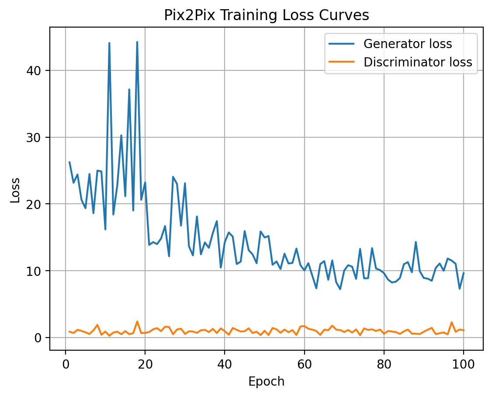
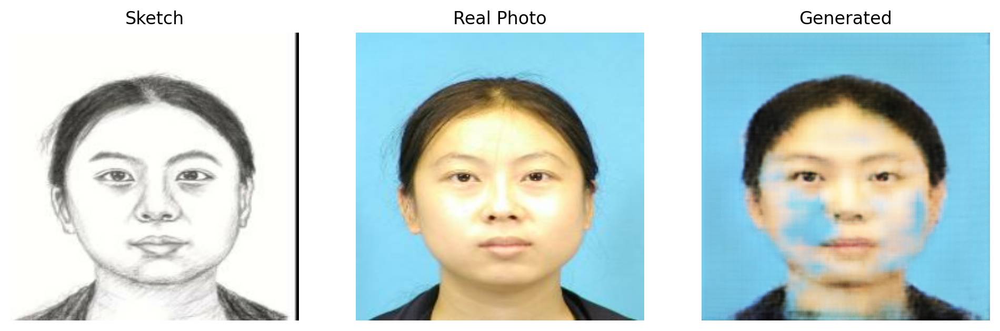
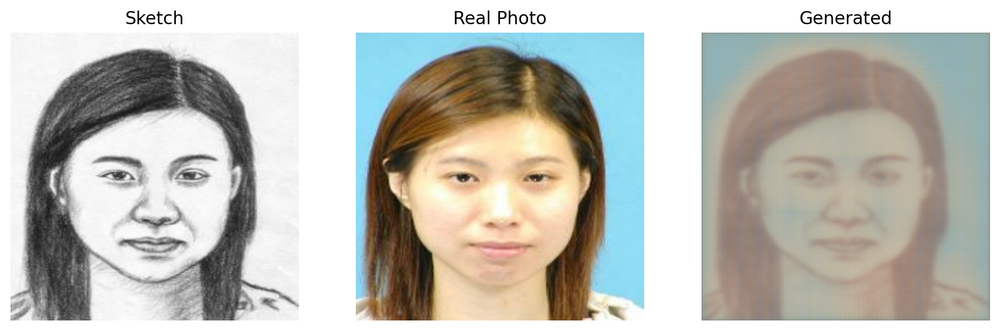
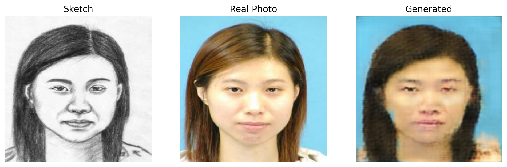
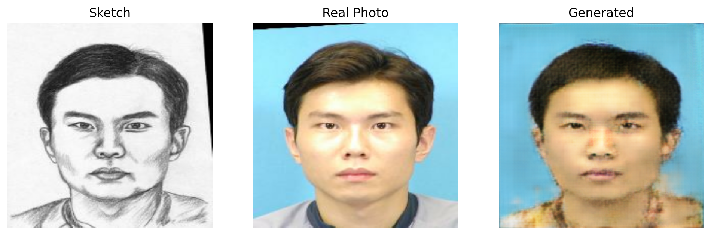

# Pix2Pix GAN – Face Sketch to Photo Synthesis

This project implements a **Pix2Pix Conditional GAN** to translate **hand-drawn face sketches into realistic face photographs** using the **CUHK Face Sketch Database (CUFS)**.

The goal is to learn a mapping between a sketch and its corresponding real photograph using **supervised image-to-image translation**.

---

# Project Overview

Sketch-to-photo synthesis is an important computer vision task with applications in:

• Law enforcement  
• Forensic investigations  
• Criminal identification systems  

In many cases, police sketches are available instead of real photographs. This project demonstrates how **deep learning can reconstruct a realistic face image from a sketch**.

The model used in this project is **Pix2Pix**, a conditional Generative Adversarial Network (cGAN).

---

# Dataset

Dataset used:

**CUHK Face Sketch Database (CUFS)**

Characteristics:

- 188 paired images
- Each sketch corresponds to a real face photo
- Frontal face images
- Controlled lighting conditions

Train / Validation split:
80% training
20% validation

Image size:
256 × 256 pixels

---

# Model Architecture

Pix2Pix consists of two neural networks trained together.

## Generator

The generator converts a **sketch → photo**.

Architecture:

- U-Net encoder-decoder
- Skip connections
- Preserves low-level spatial details

## Discriminator

The discriminator determines whether an image is:
Real photo
or
Generated photo

Architecture:

- PatchGAN discriminator
- Evaluates small image patches
- Encourages realistic local textures

---

# Training Details

Framework:
TensorFlow / Keras

Optimizer:
Adam
learning rate = 0.0002
beta1 = 0.5

Training epochs:
100 epochs

Loss functions:

- Adversarial loss
- L1 reconstruction loss

---

# Results

During training the model gradually improved the generated images.

Early epochs:

- blurry outputs
- poor facial detail

Later epochs:

- clearer face structure
- improved hair and facial features

The **best model was obtained at epoch 69**.

---

# Training Loss Curve

Generator loss decreases as the model learns to produce more realistic images.

---

# Example Generated Images

### Best generated preview

### Training progression

| Epoch 1 | Epoch 50 | Epoch 100 |
|---|---|---|
|  |  |  |

---

# Project Structure
notebook/
CUFS_Pix2Pix.ipynb

models/
pix2pix_generator_best.keras
pix2pix_generator_cufs.keras

outputs_pix2pix/
generated images during training

project_report.pdf
full written report

---

# Technologies Used

- Python
- TensorFlow
- Keras
- NumPy
- Matplotlib
- Generative Adversarial Networks (GANs)
- Computer Vision

---

# Future Improvements

Possible extensions for this project:

- Train on larger datasets
- Use CycleGAN for unpaired image translation
- Improve resolution using StyleGAN
- Add perceptual loss functions

---

# Author

A M  
Master's Degree – Data Science & Business Analytics
